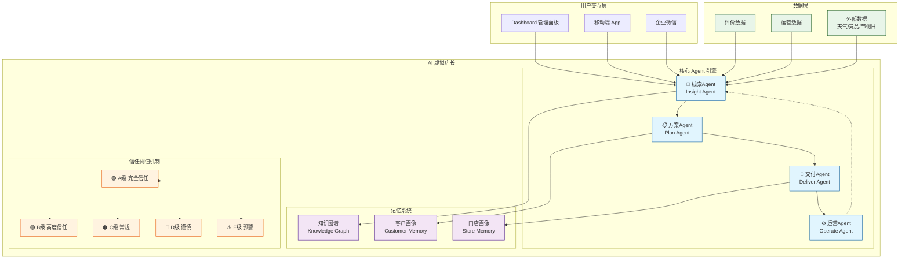
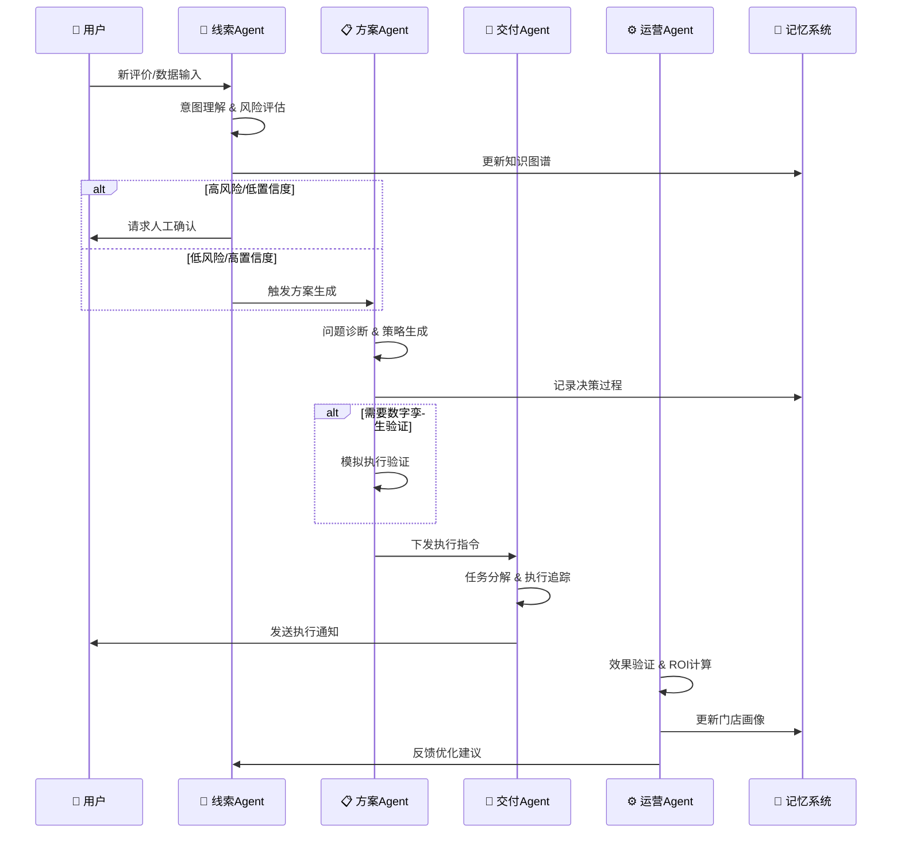
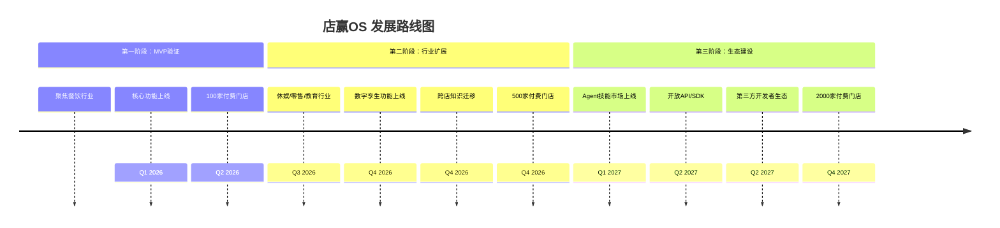

# 店赢OS | DianYing OS

```
     ██████╗ ███████╗███╗   ███╗██╗███████╗
    ██╔════╝ ██╔════╝████╗ ████║██║██╔════╝
    ██║  ███╗█████╗  ██╔████╔██║██║███████╗
    ██║   ██║██╔══╝  ██║╚██╔╝██║██║╚════██║
    ╚██████╔╝███████╗██║ ╚═╝ ██║██║███████║
     ╚═════╝ ╚══════╝╚═╝     ╚═╝╚═╝╚══════╝
                                      OS v2.0
```

<!-- Badges -->
[](LICENSE)
[](https://github.com/liuhuanxi-oss/dianying-os/stargazers)
[](CONTRIBUTING.md)
[](https://waic.opp.aliyun.com)
[](https://www.python.org/)
[](https://github.com/liuhuanxi-oss/dianying-os)

---

> 🏪 **AI-Powered One-Person Company Operating System for Retail Stores**
>
> 让一个人就是一支军队——用AI操作系统，一个人可以运营无限门店

[English](#english) · [中文](#中文) · [Quick Start](#-quick-start) · [Documentation](#-documentation)

---

## 🎯 一句话定位

> **店赢OS —— 实体门店一人公司操作系统**
>
> 不是评价管理工具，不是SaaS平台，而是让一个人轻松运营无限门店的AI原生操作系统。

| 核心指标 | 传统模式 | 店赢OS | 提升 |
|---------|---------|--------|------|
| 1人管理门店数 | 1店 | **10+店** | **10x** 🚀 |
| 差评响应时间 | 4小时 | **30秒** | **480x** ⚡ |
| 运营策略制定 | 3天 | **10分钟** | **432x** ⏱️ |
| 年度运营成本 | ¥50,000+/店 | **目标¥20,000/店** | **60%↓** 💰 |
| 客户流失预警 | 无 | **提前7天** | 🔮 |
| 运营自动化率 | 20% | **80%+** | **4x** 🤖 |

---

## ✨ 六大核心创新

| 功能 | 一句话描述 | 详细说明 |
|------|-----------|---------|
| 🤖 **AI虚拟店长** | 7×24小时在线的AI店长，不是助手，是员工 | 自主决策、自动回复评价、智能补货建议、营销投放、最优排班、风险预警 |
| 🏪 **门店数字孪生** | 先在数字环境中模拟验证，再下发执行 | 运营镜像、策略模拟、风险预测、参数调优、效果预估 |
| 📚 **跨店知识迁移** | 一家店的成功经验，可复制到千家门店 | 策略提炼、技能打包、智能匹配、一键迁移、持续迭代 |
| 💰 **动态定价引擎** | 接入天气/节假日/竞品数据，实时自动调价 | 多源数据融合、实时调价、收益优化、价格保护、策略模板 |
| 🎯 **客户生命周期自动驾驶** | 从获客到复购，AI全程自动推进 | 获客引擎、首单转化、复购驱动、流失预警、挽回机制 |
| 📋 **门店克隆** | 成功门店一键复制到新店 | 模式提取、模板生成、一键克隆、差异适配、进度追踪 |

---

## 🏗️ 系统架构



### 多Agent协同流程



---

## 🤖 Agent 体系

| Agent | 角色定位 | 核心能力 | 输入 | 输出 | 推荐模型 |
|-------|---------|---------|------|------|---------|
| **线索Agent** | 🎯 发现者 | 评价抓取、趋势预测、风险预警 | 评价/运营/外部数据 | 洞察事件 | GPT-4o-mini |
| **方案Agent** | 🧠 策略师 | 问题诊断、方案生成、资源调配 | 洞察事件 | 运营方案 | GPT-4o |
| **交付Agent** | ⚡ 执行者 | 指令执行、效果追踪、结果反馈 | 运营方案 | 执行结果 | GPT-4o-mini |
| **运营Agent** | 🔄 优化者 | 持续优化、知识积累、策略迭代 | 全局反馈 | 优化建议 | GPT-4o |

### 信任阈值机制

| 等级 | 分数范围 | 自主程度 | 操作范围 | 人工干预 | 典型场景 |
|------|---------|---------|---------|---------|---------|
| 🟢 **A级** | 95-100 | 完全自主 | 全权限 | 无需 | 标准好评回复、常规补货建议 |
| 🟡 **B级** | 85-94 | 高度自主 | 受限执行 | 短信通知 | 非标好评处理、小幅调价 |
| 🟠 **C级** | 60-84 | 辅助决策 | 建议生成 | 确认后执行 | 营销活动策划、人员调整 |
| 🔴 **D级** | 40-59 | 谨慎建议 | 预警+建议 | 优先审核 | 重大价格调整、危机公关 |
| ⚠️ **E级** | <40 | 强制预警 | 仅预警 | 必须人工 | 突发危机、大额支出 |

---

## 🔄 五环闭环

```
┌─────────────────────────────────────────────────────────────────────────────┐
│                         店赢OS 运营闭环                                      │
├─────────────────────────────────────────────────────────────────────────────┤
│                                                                             │
│    ┌─────────┐    ┌─────────┐    ┌─────────┐    ┌─────────┐    ┌─────────┐│
│    │   ①    │───►│   ②    │───►│   ③    │───►│   ④    │───►│   ⑤    ││
│    │  线索   │    │  洞察   │    │  行动   │    │  验证   │    │  复购   ││
│    │  获取   │    │  分析   │    │  执行   │    │  复盘   │    │  激励   ││
│    └────┬────┘    └────┬────┘    └────┬────┘    └────┬────┘    └────┬────┘│
│         │              │              │              │              │      │
│         ▼              ▼              ▼              ▼              ▼      │
│    ┌─────────┐    ┌─────────┐    ┌─────────┐    ┌─────────┐    ┌─────────┐│
│    │ 笔记码  │    │ 问题诊断 │    │ 指令下发 │    │ ROI计算 │    │ 会员运营 ││
│    │ 评价入口│    │ 需求挖掘 │    │ 自动执行 │    │ 效果追踪 │    │ 复购提醒 ││
│    │ 口碑引流│    │ 机会发现 │    │ 任务追踪 │    │ 持续优化 │    │ 好评激励 ││
│    └─────────┘    └─────────┘    └─────────┘    └─────────┘    └─────────┘│
│                                                                             │
│                        80%+ 运营自动化率 · 全流程AI驱动                       │
└─────────────────────────────────────────────────────────────────────────────┘
```

---

## 💰 商业模式

### 收入来源分布

| 收入来源 | 占比 | 说明 |
|---------|------|------|
| 📦 SaaS订阅 | 50% | 按门店数/月计费 |
| 🛒 Agent市场分成 | 20% | 第三方Agent销售分成 |
| 📚 知识库增值 | 15% | 行业SOP、模板库 |
| 📊 数据服务 | 10% | 行业报告、API调用 |
| 🤝 生态合作 | 5% | 供应链、流量合作 |

### 定价方案

| 套餐版本 | 价格 | 门店数 | 核心功能 |
|---------|------|-------|---------|
| **基础版** | ¥99/月 | 1店 | 评价分析+AI回复+基础报表 |
| **专业版** | ¥299/月 | 3店 | 全功能+自动执行+行业Agent |
| **旗舰版** | ¥799/月 | 10店 | 全功能+多Agent协同+优先支持 |
| **定制版** | ¥1999/月 | 不限 | API接入+私有部署+专属Agent |

---

## 🆚 竞品对比

| 维度 | 传统评价SaaS | 通用AI客服 | 店赢OS |
|------|-------------|-----------|--------|
| **产品定位** | 评价管理工具 | 客服辅助 | **一人公司操作系统** |
| **行业覆盖** | 餐饮垂直 | 全行业浅覆盖 | **全行业深覆盖** |
| **核心能力** | 评价回复 | 智能问答 | **全流程闭环运营** |
| **AI自主程度** | 辅助生成 (20%) | 半自动 (40%) | **80%+自主运营** |
| **技术架构** | 单体应用 | 微服务 | **Multi-Agent+数字孪生** |
| **创新功能** | 无 | 无 | **AI店长/数字孪生/跨店迁移** |
| **扩展性** | 封闭SaaS | 有限API | **Agent技能市场+SDK** |
| **学习成本** | 低 | 中 | **低（开箱即用）** |

---

## 📈 业务影响

| 当前痛点 | 传统方案 | 店赢OS方案 | 提升幅度 |
|---------|---------|-----------|---------|
| 老板时间碎片化 | 疲于应付 | AI自动处理 | **专注核心决策** |
| 新员工培训周期长 | 3个月带教 | SOP自动推送 | **缩短90%** |
| 运营策略靠经验 | 试错调整 | 数字孪生验证 | **成功率+300%** |
| 好经验无法复制 | 口头传授 | 一键迁移 | **批量复制** |
| 客户流失无感知 | 流失后补救 | 提前7天预警 | **主动预防** |
| 开新店周期长 | 3个月摸索 | 3天克隆 | **缩短95%** |

---

## 🚀 Quick Start

### 在线体验

> 🎯 **[立即体验 Demo](https://dianying-os.example.com)** - 无需安装，直接体验店赢OS核心功能

### 本地运行

```bash
# 1. 克隆项目
git clone https://github.com/liuhuanxi-oss/dianying-os.git
cd dianying-os

# 2. 使用 Python 启动本地服务器
python -m http.server 8080

# 3. 打开浏览器访问
open http://localhost:8080/src/index.html
```

### Docker 部署（推荐）

```bash
# 1. 克隆项目
git clone https://github.com/liuhuanxi-oss/dianying-os.git
cd dianying-os

# 2. 使用 Docker Compose 启动
docker-compose up -d

# 3. 访问 http://localhost:8080
```

---

## 📸 Screenshots

| Dashboard 首页 | AI 对话界面 | 风险预警中心 |
|:--------------:|:-----------:|:-----------:|
|  |  |  |

| 数字孪生模拟 | 门店克隆向导 | Agent 配置面板 |
|:----------:|:-----------:|:-------------:|
|  |  |  |

> 📸 截图占位区域 - 实际截图将随版本更新逐步添加

---

## 🗺️ Roadmap



### 详细路线图

| 阶段 | 时间 | 目标 | 核心功能 |
|------|------|------|---------|
| **MVP** | 2026 Q1-Q2 | 100家付费门店 | AI虚拟店长、基础评价分析、执行追踪 |
| **Scale** | 2026 Q3-Q4 | 500家付费门店 | 数字孪生、跨店迁移、多行业覆盖 |
| **Ecosystem** | 2027 全年 | 2000家+生态 | Agent市场、API开放、开发者生态 |

---

## 📁 Project Structure

```
dianying-os/
├── src/                          # 前端源码
│   ├── index.html               # 🏠 主入口页面
│   ├── css/
│   │   └── style.css            # 🎨 全局样式
│   ├── js/
│   │   ├── app.js               # 📱 应用主逻辑
│   │   ├── agents/              # 🤖 Agent 模块
│   │   │   ├── insight.js       # 线索Agent
│   │   │   ├── plan.js          # 方案Agent
│   │   │   ├── deliver.js       # 交付Agent
│   │   │   └── operate.js       # 运营Agent
│   │   └── modules/             # 📦 业务模块
│   │       ├── review.js        # 评价管理
│   │       ├── pricing.js       # 动态定价
│   │       ├── customer.js      # 客户管理
│   │       └── store.js         # 门店管理
│   └── assets/                  # 🖼️ 静态资源
│       └── logo.svg             # Logo
│
├── config/                       # ⚙️ 配置文件
│   └── store-config.json        # 门店配置模板
│
├── prompts/                      # 💬 AI Prompt 模板
│   ├── virtual-manager.md       # AI虚拟店长 Prompt
│   ├── insight-agent.md         # 线索Agent Prompt
│   ├── plan-agent.md            # 方案Agent Prompt
│   ├── deliver-agent.md         # 交付Agent Prompt
│   └── operate-agent.md         # 运营Agent Prompt
│
├── docs/                         # 📚 文档
│   ├── architecture.md          # 技术架构文档
│   ├── api.md                   # API接口文档
│   ├── demo-script.md           # Demo演示脚本
│   ├── ROADMAP.md               # 发展路线图
│   └── images/                  # 📸 截图存放
│
├── tests/                        # 🧪 测试代码
│   └── ...
│
├── .gitignore                   # Git忽略配置
├── LICENSE                      # MIT开源许可证
├── README.md                    # 📌 项目说明（本文档）
├── CONTRIBUTING.md              # 贡献指南
├── QUICK_START.md               # 快速开始指南
└── package.json                 # Node.js依赖配置
```

---

## 🛠️ Tech Stack

| 层级 | 技术选型 | 版本 | 说明 |
|------|---------|------|------|
| **前端框架** | HTML5 + CSS3 + JavaScript | ES6+ | 轻量级，无需构建工具 |
| **AI引擎** | Coze (扣子) 平台 | - | 多Agent协同核心 |
| **数据存储** | LocalStorage / IndexedDB | - | 客户端数据持久化 |
| **图表库** | Chart.js | 4.x | 数据可视化 |
| **图标** | Emoji + SVG | - | 轻量图标方案 |
| **部署** | Nginx / Docker | - | 生产环境部署 |

### 依赖包

```json
{
  "name": "dianying-os",
  "version": "2.0.0",
  "description": "AI-Powered One-Person Company OS for Retail Stores",
  "scripts": {
    "start": "python -m http.server 8080",
    "dev": "python -m http.server 3000",
    "docker": "docker-compose up -d"
  },
  "keywords": [
    "ai",
    "agent",
    "retail",
    "store-management",
    "multi-agent"
  ]
}
```

---

## 🤝 Contributing

Contributions are welcome! Please read our [CONTRIBUTING.md](CONTRIBUTING.md) for details.

### 开发流程

```bash
# 1. Fork 本仓库
# 2. 创建特性分支
git checkout -b feature/amazing-feature

# 3. 提交更改
git commit -m 'feat: add amazing feature'

# 4. 推送分支
git push origin feature/amazing-feature

# 5. 创建 Pull Request
```

### 贡献者

<!-- ALL-CONTRIBUTORS-BADGE:START - Do not remove or modify this section -->
[](#contributors-)
<!-- ALL-CONTRIBUTORS-BADGE:END -->

---

## 📄 License

This project is licensed under the MIT License - see the [LICENSE](LICENSE) file for details.

```
MIT License

Copyright (c) 2026 店赢OS (DianYing OS)
https://github.com/liuhuanxi-oss/dianying-os

Permission is hereby granted, free of charge, to any person obtaining a copy
of this software and associated documentation files (the "Software"), to deal
in the Software without restriction, including without limitation the rights
to use, copy, modify, merge, publish, distribute, sublicense, and/or sell
copies of the Software, and to permit persons to whom the Software is
furnished to do so, subject to the following conditions:

The above copyright notice and this permission notice shall be included in all
copies or substantial portions of the Software.

THE SOFTWARE IS PROVIDED "AS IS", WITHOUT WARRANTY OF ANY KIND, EXPRESS OR
IMPLIED, INCLUDING BUT NOT LIMITED TO THE WARRANTIES OF MERCHANTABILITY,
FITNESS FOR A PARTICULAR PURPOSE AND NONINFRINGEMENT. IN NO EVENT SHALL THE
AUTHORS OR COPYRIGHT HOLDERS BE LIABLE FOR ANY CLAIM, DAMAGES OR OTHER
LIABILITY, WHETHER IN AN ACTION OF CONTRACT, TORT OR OTHERWISE, ARISING FROM,
OUT OF OR IN CONNECTION WITH THE SOFTWARE OR THE USE OR OTHER DEALINGS IN THE
SOFTWARE.
```

---

## 🔗 Links

- 📖 [文档中心](docs/)
- 🐛 [问题反馈](https://github.com/liuhuanxi-oss/dianying-os/issues)
- 💬 [讨论区](https://github.com/liuhuanxi-oss/dianying-os/discussions)
- 📦 [WAIC OPC 2026](https://waic.opp.aliyun.com)

---

<p align="center">
  <strong>🚀 让一个人就是一支军队——用AI操作系统，一个人可以运营无限门店。</strong>
</p>

---

## English

### What is DianYing OS?

**DianYing OS** is an AI-native operating system designed for small retail businesses. It empowers a single person to manage multiple stores with intelligent automation.

### Core Features

| Feature | Description |
|---------|-------------|
| 🤖 **AI Virtual Store Manager** | 24/7 AI-powered manager that handles reviews, pricing, and operations autonomously |
| 🏪 **Store Digital Twin** | Simulate strategies in digital environment before real-world execution |
| 📚 **Cross-Store Knowledge Transfer** | Replicate successful strategies from one store to many |
| 💰 **Dynamic Pricing Engine** | AI-driven pricing based on weather, holidays, and demand |
| 🎯 **Customer Lifecycle Autopilot** | Automated customer journey from acquisition to retention |
| 📋 **Store Cloning** | One-click replication of successful store operations |

### Architecture

See the diagram in Chinese section above - the multi-Agent system coordinates Insight, Plan, Deliver, and Operate agents to achieve fully automated store operations.

### Quick Start

```bash
git clone https://github.com/liuhuanxi-oss/dianying-os.git
cd dianying-os
python -m http.server 8080
# Visit http://localhost:8080/src/index.html
```

### License

MIT License - see [LICENSE](LICENSE) file for details.

---

<p align="center">
  <a href="https://github.com/liuhuanxi-oss/dianying-os">⭐ Star us on GitHub</a>
  ·
  <a href="https://github.com/liuhuanxi-oss/dianying-os/issues">🐛 Report Bug</a>
  ·
  <a href="https://github.com/liuhuanxi-oss/dianying-os/discussions">💬 Join Discussion</a>
</p>

<p align="center">
  Made with ❤️ by <a href="https://github.com/liuhuanxi-oss">@liuhuanxi-oss</a>
  ·
  WAIC OPC 2026
</p>
