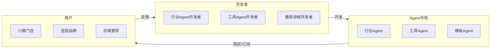

# 店赢OS 发展路线图

> 本文档描述店赢OS的发展规划和未来愿景。

**文档版本**: v2.0
**更新日期**: 2026年4月
**维护者**: 店赢OS Team

---

## 📋 目录

- [愿景与使命](#愿景与使命)
- [整体规划](#整体规划)
- [第一阶段：MVP验证](#第一阶段mvp验证)
- [第二阶段：行业扩展](#第二阶段行业扩展)
- [第三阶段：生态建设](#第三阶段生态建设)
- [技术演进](#技术演进)
- [里程碑](#里程碑)

---

## 愿景与使命

### 愿景

> **让每个人都可以是自己的CEO**

我们相信，技术不应该让小微经营者更累，而应该让他们更轻松。店赢OS的使命是用AI技术赋能小微门店经营者，让他们一个人就能运营无限门店。

### 使命

```
┌─────────────────────────────────────────────────────────────┐
│                                                             │
│     传统模式           │        店赢OS 模式                 │
│     ─────────────      │        ─────────────              │
│     老板=员工          │        老板=CEO                   │
│     1人管1店           │        1人管10+店                 │
│     疲于应付           │        运筹帷幄                   │
│                                                             │
└─────────────────────────────────────────────────────────────┘
```

### 核心价值观

| 价值观 | 说明 |
|-------|------|
| 🎯 **用户第一** | 所有决策以用户价值为导向 |
| 🤖 **AI原生** | 从零设计，不是旧系统的AI升级 |
| 📦 **开箱即用** | 零配置，5分钟上手 |
| 🔒 **安全可控** | AI决策可追溯、可干预 |
| 🌱 **持续进化** | 产品和AI能力持续学习优化 |

---

## 整体规划

### 时间线总览

```mermaid
gantt
    title 店赢OS 发展时间线

    section MVP阶段
    餐饮行业核心功能        :2026-Q1, 2026-Q2
    100家付费门店          :2026-Q2, 2026-Q2

    section Scale阶段
    多行业覆盖             :2026-Q3, 2026-Q4
    数字孪生+知识迁移      :2026-Q4, 2026-Q4
    500家付费门店          :2026-Q4, 2026-Q4

    section Ecosystem阶段
    Agent技能市场          :2027-Q1, 2027-Q2
    API/SDK开放            :2027-Q2, 2027-Q3
    第三方开发者生态       :2027-Q2, 2027-Q4
    2000家+生态            :2027-Q4, 2027-Q4
```

### 关键指标

| 指标 | 2026 Q2 | 2026 Q4 | 2027 Q4 |
|------|---------|---------|---------|
| 付费门店数 | 100 | 500 | 2000+ |
| 行业覆盖 | 1个 | 6个 | 10+ |
| Agent数量 | 4个 | 12个 | 50+ |
| 运营自动化率 | 60% | 80% | 90% |
| 知识库条目 | 1000 | 10000 | 100000+ |

---

## 第一阶段：MVP验证

> **时间**: 2026年 Q1 - Q2
> **目标**: 100家付费门店

### 目标

```
┌─────────────────────────────────────────────────────────────┐
│                    MVP 阶段目标                              │
├─────────────────────────────────────────────────────────────┤
│                                                              │
│  🎯 聚焦餐饮行业，验证核心价值                              │
│  📦 完成AI虚拟店长基础能力                                  │
│  ✅ 建立产品-市场匹配（PMF）                                │
│  💰 获得100家付费客户                                       │
│                                                              │
└─────────────────────────────────────────────────────────────┘
```

### 核心功能

| 功能模块 | 功能点 | 优先级 | 交付时间 |
|---------|-------|--------|---------|
| **AI虚拟店长** | | | |
| | 评价自动分析 | P0 | Q1 |
| | AI生成回复建议 | P0 | Q1 |
| | 信任阈值机制 | P0 | Q1 |
| | 基础运营建议 | P1 | Q2 |
| **线索Agent** | | | |
| | 多平台评价抓取 | P0 | Q1 |
| | 情感分析 | P0 | Q1 |
| | 风险预警 | P1 | Q2 |
| **方案Agent** | | | |
| | 问题诊断 | P0 | Q1 |
| | 策略生成 | P1 | Q2 |
| | 知识库检索 | P1 | Q2 |
| **交付Agent** | | | |
| | 指令下发 | P0 | Q1 |
| | 执行追踪 | P1 | Q2 |
| | 结果反馈 | P1 | Q2 |

### 技术里程碑

| 里程碑 | 完成标准 | 目标日期 |
|-------|---------|---------|
| MVP上线 | 核心功能可用 | 2026-03-31 |
| 内测完成 | 10家内测用户 | 2026-04-30 |
| 公测上线 | 开放公测 | 2026-05-15 |
| 商业化上线 | 付费功能就绪 | 2026-06-01 |

### 成功指标

| 指标 | 目标值 | 衡量方式 |
|------|-------|---------|
| 日活用户 | 50+ | 每日登录数 |
| 周留存 | 60%+ | 7日留存率 |
| 评价处理速度 | <5s | 端到端延迟 |
| 自动执行率 | 50%+ | 自动执行/总任务 |
| 客户满意度 | 4.0+ | NPS评分 |
| 付费转化 | 10%+ | 公测转付费 |

---

## 第二阶段：行业扩展

> **时间**: 2026年 Q3 - Q4
> **目标**: 500家付费门店

### 目标

```
┌─────────────────────────────────────────────────────────────┐
│                    Scale 阶段目标                            │
├─────────────────────────────────────────────────────────────┤
│                                                              │
│  🏪 扩展到6大行业（餐饮/零售/休娱/教育/物业/医疗）           │
│  🔄 上线数字孪生和跨店知识迁移                              │
│  📈 付费客户增长至500家                                     │
│  ⚡ 运营自动化率提升至80%                                   │
│                                                              │
└─────────────────────────────────────────────────────────────┘
```

### 新增功能

| 功能模块 | 功能点 | 优先级 | 交付时间 |
|---------|-------|--------|---------|
| **数字孪生** | | | |
| | 门店数字建模 | P0 | Q3 |
| | 策略模拟验证 | P0 | Q3 |
| | 效果预估 | P1 | Q4 |
| **跨店知识迁移** | | | |
| | 策略提炼 | P0 | Q3 |
| | 技能打包 | P0 | Q3 |
| | 一键迁移 | P1 | Q4 |
| **动态定价** | | | |
| | 多源数据接入 | P0 | Q3 |
| | 实时调价 | P0 | Q3 |
| | 策略模板 | P1 | Q4 |
| **门店克隆** | | | |
| | 模式提取 | P0 | Q3 |
| | 一键克隆 | P1 | Q4 |
| | 差异适配 | P2 | Q4 |

### 行业覆盖

| 行业 | 上线时间 | 核心功能 |
|------|---------|---------|
| 餐饮 | Q1（MVP） | 全功能 |
| 零售 | Q3 | 库存/促销/陈列 |
| 休娱 | Q3 | 预约/体验/会员 |
| 教育 | Q4 | 续费/回访/口碑 |
| 物业 | Q4 | 投诉/报修/巡检 |
| 医疗 | Q4 | 预约/回访/合规 |

### 技术里程碑

| 里程碑 | 完成标准 | 目标日期 |
|-------|---------|---------|
| 数字孪生上线 | 模拟引擎可用 | 2026-07-31 |
| 跨店迁移上线 | 迁移功能可用 | 2026-08-31 |
| 第二行业上线 | 零售行业可用 | 2026-09-15 |
| 500家付费 | 达成目标 | 2026-12-31 |

### 成功指标

| 指标 | 目标值 | 衡量方式 |
|------|-------|---------|
| 付费门店数 | 500 | 季度末 |
| 行业覆盖 | 6个 | 上线行业数 |
| 续费率 | 85%+ | 季度续费率 |
| NPS评分 | 50+ | 净推荐值 |
| 自动执行率 | 80% | 自动执行/总任务 |

---

## 第三阶段：生态建设

> **时间**: 2027年 全年
> **目标**: 2000家+生态

### 目标

```
┌─────────────────────────────────────────────────────────────┐
│                   Ecosystem 阶段目标                         │
├─────────────────────────────────────────────────────────────┤
│                                                              │
│  🛒 上线Agent技能市场，构建开发者生态                       │
│  🔌 开放API/SDK，支持第三方集成                             │
│  📈 付费客户突破2000家                                       │
│  🌍 拓展国际市场                                             │
│                                                              │
└─────────────────────────────────────────────────────────────┘
```

### Agent技能市场



#### Agent类型规划

| 类型 | 示例 | 开发者 | 商业模式 |
|------|------|--------|---------|
| 行业Agent | 餐饮Agent、零售Agent | 行业专家 | 订阅/买断 |
| 工具Agent | 排班优化、库存预警 | 技术开发者 | 按次/订阅 |
| 模板Agent | 节假日促销、开业活动 | 运营专家 | 模板市场 |
| 数据Agent | 竞品分析、行业报告 | 数据公司 | 数据服务 |

### API/SDK开放

| API类型 | 说明 | 上线时间 |
|--------|------|---------|
| 评价API | 评价数据的读取和写入 | Q2 2027 |
| Agent API | Agent调用接口 | Q2 2027 |
| 知识库API | 知识检索和写入 | Q2 2027 |
| 插件SDK | 插件开发包 | Q2 2027 |
| Webhook | 事件订阅接口 | Q3 2027 |

### 技术里程碑

| 里程碑 | 完成标准 | 目标日期 |
|-------|---------|---------|
| Agent市场上线 | 交易功能可用 | 2027-03-31 |
| API正式发布 | 文档完善 | 2027-06-30 |
| SDK发布 | 多语言SDK | 2027-06-30 |
| 开发者社区 | 100+开发者 | 2027-09-30 |
| 2000家付费 | 达成目标 | 2027-12-31 |

### 成功指标

| 指标 | 目标值 | 衡量方式 |
|------|-------|---------|
| 付费门店数 | 2000+ | 年度末 |
| Agent数量 | 50+ | 上线Agent |
| 开发者数量 | 100+ | 注册开发者 |
| API调用量 | 1M+/月 | 月度API |
| 生态收入占比 | 20% | 收入占比 |

---

## 技术演进

### AI能力演进

```mermaid
roadmap
    direction TB
    Y2026 : Y2026

    2026-Q1 : 单Agent<br/>规则驱动
    2026-Q2 : 多Agent协同<br/>基础自主
    2026-Q4 : 行业知识增强<br/>深度学习
    2027-Q2 : Agent市场<br/>自主学习
    2027-Q4 : 多模态理解<br/>自主进化
```

### 架构演进

| 阶段 | 架构特点 | 扩展方式 |
|------|---------|---------|
| MVP | 单体架构 | 垂直扩展 |
| Scale | 微服务架构 | 水平扩展 |
| Ecosystem | Serverless + Edge | 按需扩展 |

### 数据能力演进

| 阶段 | 数据能力 | 价值 |
|------|---------|------|
| MVP | 基础分析 | 运营可见性 |
| Scale | 预测分析 | 风险预警 |
| Ecosystem | 智能推荐 | 个性化服务 |

---

## 里程碑

### 历史里程碑

| 日期 | 里程碑 | 说明 |
|------|--------|------|
| 2026-01 | 项目启动 | 团队组建，项目立项 |
| 2026-03 | MVP开发 | 核心功能开发 |
| 2026-04 | 内测上线 | 10家内测用户 |
| 2026-06 | 商业化上线 | 正式收费 |

### 未来里程碑

| 日期 | 里程碑 | 说明 |
|------|--------|------|
| 2026-09 | 500家目标 | 多行业覆盖 |
| 2027-03 | Agent市场上线 | 生态启动 |
| 2027-06 | API/SDK发布 | 开发者赋能 |
| 2027-12 | 2000家目标 | 生态成熟 |

---

## 附录

### 术语表

| 术语 | 说明 |
|-----|------|
| MVP | Minimum Viable Product，最小可行产品 |
| PMF | Product-Market Fit，产品-市场匹配 |
| PM | Product Manager，产品经理 |
| Agent | AI智能体，可自主执行任务的AI程序 |
| SaaS | Software as a Service，软件即服务 |
| NPS | Net Promoter Score，净推荐值 |

### 参考资料

- [架构文档](architecture.md)
- [API文档](api.md)
- [Demo脚本](demo-script.md)

---

**更新日志**:

| 版本 | 日期 | 更新内容 |
|------|------|---------|
| v2.0 | 2026-04 | 完善三阶段规划 |
| v1.0 | 2026-01 | 初始版本 |

---

<p align="center">
  <strong>🚀 让一个人就是一支军队</strong>
</p>

<p align="center">
  <a href="https://github.com/liuhuanxi-oss/dianying-os">GitHub</a>
  ·
  <a href="https://github.com/liuhuanxi-oss/dianying-os/discussions">Discussions</a>
  ·
  <a href="https://github.com/liuhuanxi-oss/dianying-os/issues">Issues</a>
</p>
