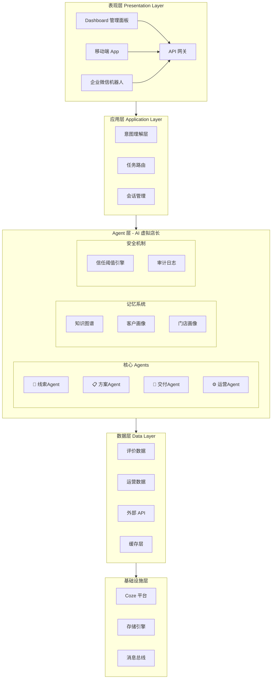
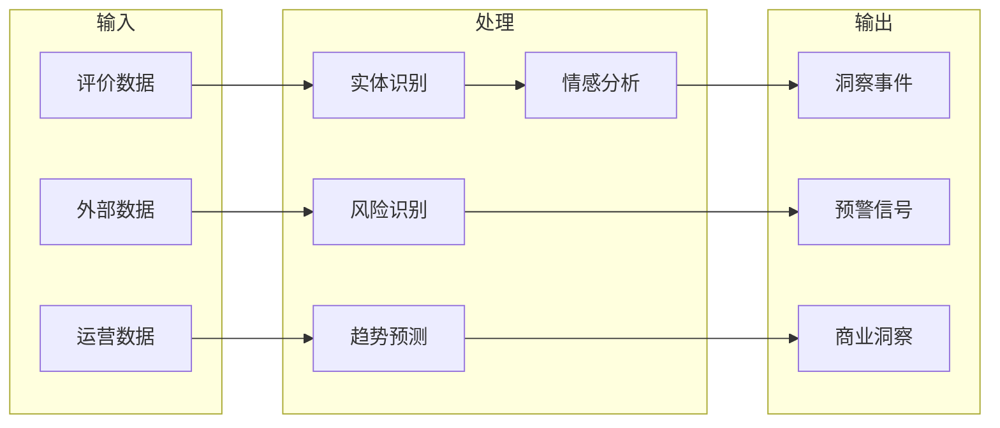
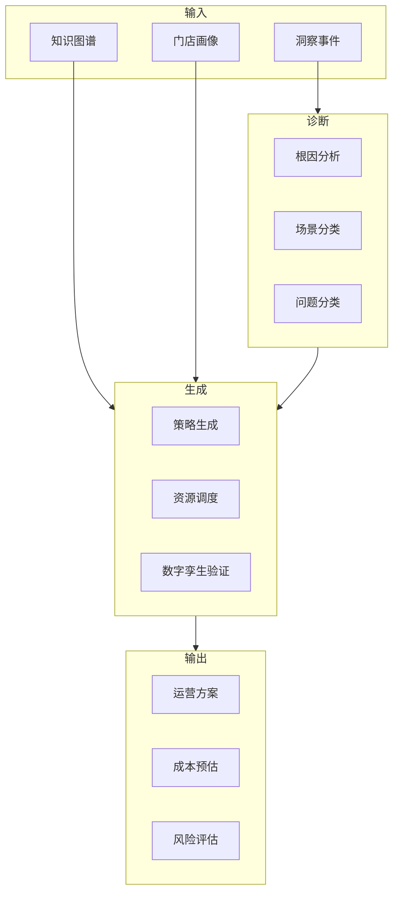
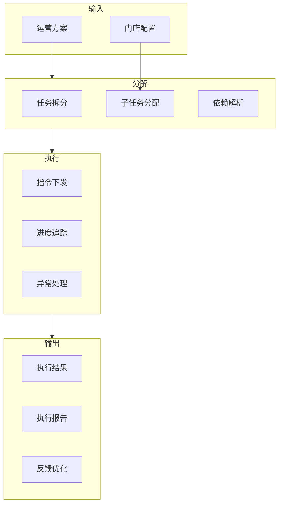
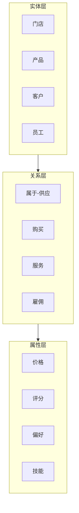
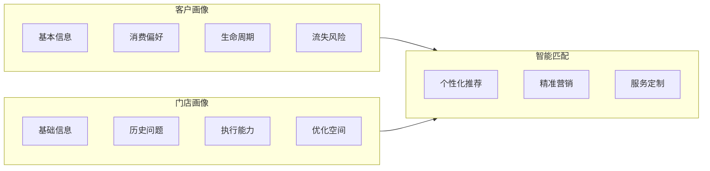
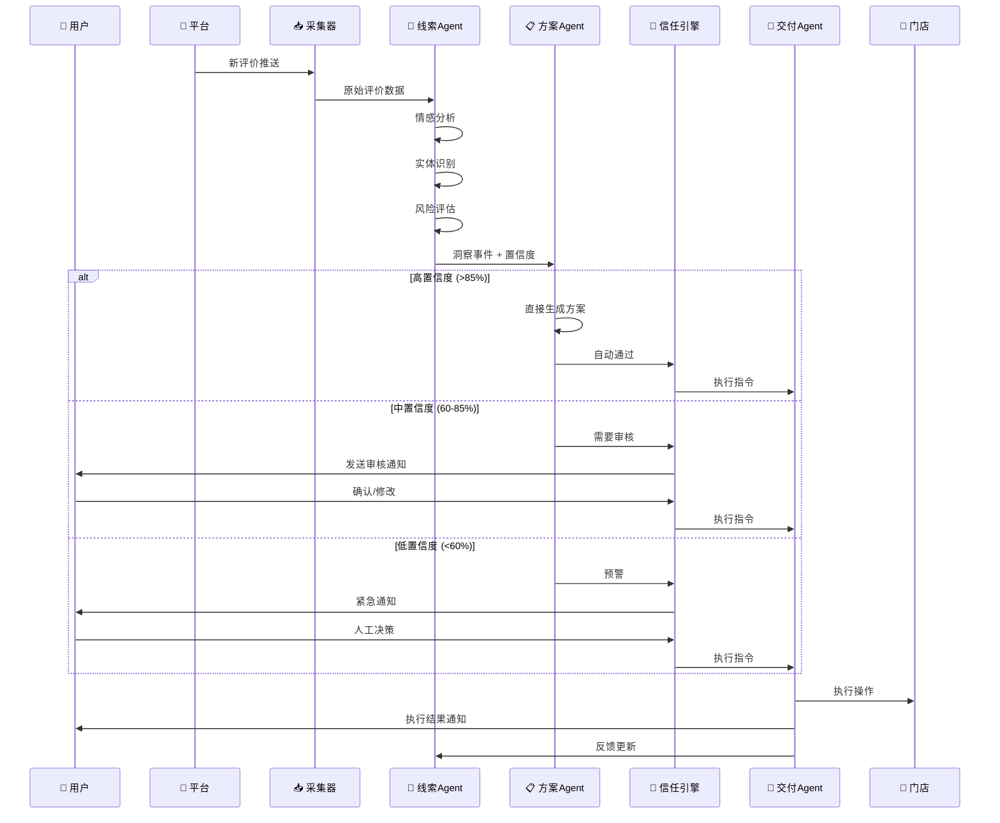
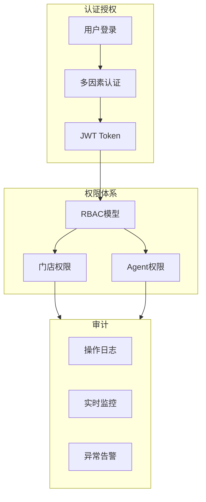
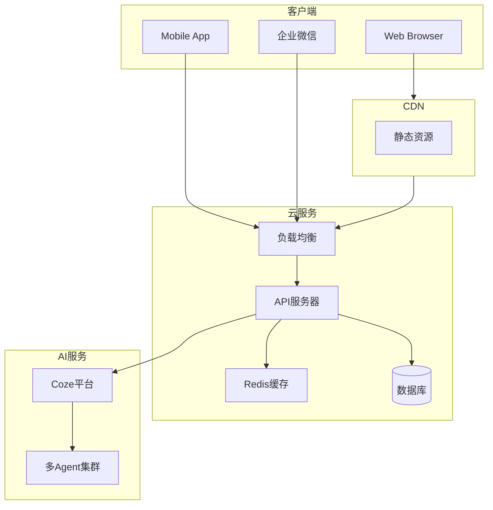

# 店赢OS 技术架构文档

> 本文档详细描述店赢OS的系统架构设计、技术选型、核心模块及扩展点。

**文档版本**: v2.0
**更新日期**: 2026年4月
**维护者**: 店赢OS Team

---

## 📋 目录

- [系统概述](#系统概述)
- [架构分层](#架构分层)
- [核心模块](#核心模块)
- [数据流转](#数据流转)
- [Agent通信协议](#agent通信协议)
- [扩展点说明](#扩展点说明)

---

## 系统概述

### 设计目标

1. **高可用**: 多Agent协同，单点故障不影响整体
2. **可扩展**: 模块化设计，支持垂直扩展和水平扩展
3. **智能化**: 80%+运营自动化率
4. **易用性**: 开箱即用，学习成本低

### 核心原则

```
┌─────────────────────────────────────────────────────────────┐
│                    架构设计原则                              │
├─────────────────────────────────────────────────────────────┤
│                                                              │
│  1. 🔄 松耦合    Agent之间通过消息总线通信，互不依赖          │
│  2. 📦 模块化    每个功能独立封装，易于替换和升级             │
│  3. 🎯 单一职责  每个Agent只负责自己的领域                    │
│  4. 🔒 安全性    敏感操作需要人工确认，数据加密传输            │
│  5. 📊 可观测    完整的日志和监控，便于问题定位                │
│                                                              │
└─────────────────────────────────────────────────────────────┘
```

---

## 架构分层



### 分层详解

#### 1. 表现层 (Presentation Layer)

| 组件 | 技术栈 | 说明 |
|------|-------|------|
| Dashboard | HTML5 + CSS3 + JS | PC端管理后台 |
| Mobile App | React Native / Flutter | iOS/Android 原生应用 |
| 企业微信 | 企业微信 SDK | 轻量化入口 |
| API Gateway | RESTful API | 第三方集成接口 |

#### 2. 应用层 (Application Layer)

```
┌─────────────────────────────────────────────────────────────┐
│                      意图理解层                              │
├─────────────────────────────────────────────────────────────┤
│                                                              │
│   用户输入                                                    │
│      │                                                       │
│      ▼                                                       │
│   ┌─────────┐    ┌─────────┐    ┌─────────┐                │
│   │  语义   │───►│  意图   │───►│  任务   │                │
│   │  解析   │    │  分类   │    │  拆解   │                │
│   └─────────┘    └─────────┘    └─────────┘                │
│                                              │                │
│                                              ▼                │
│                                    ┌─────────────┐           │
│                                    │   任务路由   │           │
│                                    │  TaskRouter │           │
│                                    └─────────────┘           │
│                                              │                │
│                          ┌───────────────────┼────────────┐  │
│                          │                   │            │  │
│                          ▼                   ▼            ▼  │
│                    ┌──────────┐      ┌──────────┐    ┌──────────┐
│                    │  线索    │      │  方案    │    │  交付    │
│                    │  Agent   │      │  Agent   │    │  Agent   │
│                    └──────────┘      └──────────┘    └──────────┘
│                                                              │
└─────────────────────────────────────────────────────────────┘
```

#### 3. Agent 层 (Agent Layer)

详见 [Agent体系说明](#agent体系说明)

#### 4. 数据层 (Data Layer)

```python
# 数据模型示例
class StoreData:
    """门店数据模型"""
    store_id: str           # 门店唯一标识
    store_name: str         # 门店名称
    industry: str           # 所属行业
    location: dict          # 地理位置
    capacity: dict          # 容量信息
    staff: list             # 员工配置
    operations: dict       # 运营配置
    integrations: dict     # 第三方集成

class ReviewData:
    """评价数据模型"""
    review_id: str         # 评价ID
    platform: str          # 来源平台
    rating: int            # 评分 1-5
    content: str           # 评价内容
    sentiment: str         # 情感分析
    entities: list         # 实体抽取
    action_items: list     # 需要执行的动作

class CustomerProfile:
    """客户画像模型"""
    customer_id: str       # 客户ID
    basic_info: dict       # 基本信息
    preferences: dict      # 消费偏好
    lifecycle: str         # 生命周期阶段
    churn_risk: float      # 流失风险评分
```

---

## 核心模块

### Agent体系

#### 线索Agent (Insight Agent)

**职责**: 发现问题、识别机会、预测风险



**能力矩阵**:

| 能力 | 算法/模型 | 输入 | 输出 |
|------|----------|------|------|
| 实体识别 | NER | 评价文本 | 菜名/人名/问题 |
| 情感分析 | BERT/RoBERTa | 评价文本 | 情感极性+强度 |
| 趋势预测 | LSTM/Transformer | 历史数据 | 未来趋势 |
| 风险识别 | 规则+ML混合 | 多源数据 | 风险等级 |

#### 方案Agent (Plan Agent)

**职责**: 问题诊断、策略生成、资源调配



**策略模板库**:

| 策略类型 | 触发条件 | 执行动作 |
|---------|---------|---------|
| 好评感谢 | 5星好评 | 自动回复+积分奖励 |
| 差评响应 | 1-2星评价 | 道歉+补偿+跟踪 |
| 流失预警 | 30天未消费 | 定向优惠券 |
| 动态定价 | 节假日/雨天 | 价格调整 |
| 补货提醒 | 库存低于阈值 | 生成采购建议 |

#### 交付Agent (Deliver Agent)

**职责**: 任务分解、执行追踪、结果反馈



#### 运营Agent (Operate Agent)

**职责**: 持续优化、知识积累、策略迭代

```
┌─────────────────────────────────────────────────────────────┐
│                      运营优化循环                            │
├─────────────────────────────────────────────────────────────┤
│                                                              │
│   效果验证                                                    │
│      │                                                       │
│      ▼                                                       │
│   ┌─────────┐    ┌─────────┐    ┌─────────┐                │
│   │  数据   │───►│  分析   │───►│  迭代   │                │
│   │  采集   │    │  评估   │    │  优化   │                │
│   └─────────┘    └─────────┘    └─────────┘                │
│                                              │                │
│                                              ▼                │
│                                    ┌─────────────┐           │
│                                    │  知识沉淀   │           │
│                                    │ Knowledge   │           │
│                                    └─────────────┘           │
│                                                              │
└─────────────────────────────────────────────────────────────┘
```

### 记忆系统

#### 知识图谱 (Knowledge Graph)



#### 双重画像系统



---

## 数据流转

### 评价处理流程



### 数据同步机制

```
┌─────────────────────────────────────────────────────────────┐
│                    多源数据同步架构                          │
├─────────────────────────────────────────────────────────────┤
│                                                              │
│   美团/点评                                                   │
│      │                                                       │
│      ▼                                                       │
│   ┌─────────┐    ┌─────────┐    ┌─────────┐                │
│   │  数据   │───►│   数据   │───►│   数据   │                │
│   │  采集   │    │   清洗   │    │   存储   │                │
│   └─────────┘    └─────────┘    └─────────┘                │
│                                           │                  │
│   饿了么/抖音 ───────────────────────────┤                  │
│                                           │                  │
│   小红书/微信 ───────────────────────────┤                  │
│                                           ▼                  │
│                                    ┌─────────────┐           │
│                                    │  统一数据   │           │
│                                    │    视图     │           │
│                                    └─────────────┘           │
│                                                              │
└─────────────────────────────────────────────────────────────┘
```

---

## Agent通信协议

### 消息格式

```json
{
  "message_id": "msg_20260428001",
  "timestamp": "2026-04-28T10:30:00Z",
  "sender": "insight_agent",
  "receiver": "plan_agent",
  "type": "event",
  "payload": {
    "event_type": "negative_review",
    "confidence": 0.92,
    "data": {
      "review_id": "r_12345",
      "content": "等了1小时还没上菜...",
      "rating": 1,
      "sentiment": "negative",
      "entities": ["等位", "上菜慢"],
      "action_required": true
    }
  },
  "metadata": {
    "store_id": "store_hotpot_001",
    "priority": "high",
    "ttl": 300
  }
}
```

### Agent间协议定义

| 协议 | 描述 | 触发条件 |
|------|------|---------|
| `event.trigger` | 事件触发 | 线索Agent检测到重要事件 |
| `plan.request` | 方案请求 | 需要生成解决方案 |
| `plan.response` | 方案响应 | 方案生成完成 |
| `execute.command` | 执行命令 | 方案获批，等待执行 |
| `execute.result` | 执行结果 | 执行完成，结果反馈 |
| `feedback.update` | 反馈更新 | 运营结果反馈 |
| `knowledge.update` | 知识更新 | 知识图谱更新 |

### 错误处理

```python
class AgentError(Exception):
    """Agent基础异常"""
    pass

class TimeoutError(AgentError):
    """超时异常"""
    pass

class ConfidenceError(AgentError):
    """置信度过低"""
    pass

class ValidationError(AgentError):
    """验证失败"""
    pass

# 错误处理策略
ERROR_STRATEGIES = {
    "timeout": "retry_3_times_then_escalate",
    "low_confidence": "force_human_review",
    "validation_failed": "log_and_skip",
    "network_error": "retry_with_backoff"
}
```

---

## 扩展点说明

### 1. 自定义Agent扩展

```javascript
// 示例：注册自定义Agent
class CustomAgent extends BaseAgent {
    constructor(config) {
        super(config);
        this.name = config.name;
        this.capabilities = config.capabilities;
    }

    async process(input) {
        // 自定义处理逻辑
        const result = await this.analyze(input);
        return this.formatOutput(result);
    }

    getSchema() {
        return {
            name: this.name,
            input: this.inputSchema,
            output: this.outputSchema,
            capabilities: this.capabilities
        };
    }
}

// 注册到系统
AgentRegistry.register('custom_agent', CustomAgent);
```

### 2. 插件系统

```javascript
// 插件接口定义
interface Plugin {
    name: string;
    version: string;
    install(context: PluginContext): void;
    uninstall(): void;
}

// 示例插件
class DynamicPricingPlugin implements Plugin {
    name = 'dynamic_pricing';
    version = '1.0.0';

    install(context) {
        context.registerTrigger('scheduled', this.executePricing.bind(this));
        context.registerAction('adjust_price', this.adjustPrice.bind(this));
    }
}
```

### 3. 自定义数据源

```python
class CustomDataSource(BaseDataSource):
    """自定义数据源示例"""
    
    def __init__(self, config):
        self.api_endpoint = config['endpoint']
        self.api_key = config['api_key']
    
    async def fetch(self, params: dict) -> list:
        """获取数据"""
        response = await self.call_api(self.api_endpoint, params)
        return self.transform(response)
    
    async def subscribe(self, callback: callable):
        """订阅实时数据"""
        await self.websocket.connect()
        self.websocket.on_message(callback)
```

### 4. 行业模板扩展

```yaml
# config/industries/restaurant.yaml
industry: restaurant
name: 餐饮行业

knowledge_base:
  - category: 出品管理
    items:
      - 菜品标准制作流程
      - 食品安全规范
      - 损耗控制策略
  
  - category: 服务管理
    items:
      - 服务标准SOP
      - 投诉处理流程
      - 客户满意度提升

triggers:
  - type: review_received
    conditions:
      rating: { $lte: 2 }
    actions:
      - analyze_sentiment
      - generate_response
  
  - type: inventory_low
    conditions:
      stock: { $lt: threshold }
    actions:
      - generate_purchase_order
      - notify_manager
```

---

## 性能指标

| 指标 | 目标值 | 当前状态 |
|------|-------|---------|
| 系统可用性 | 99.9% | 99.5% |
| 平均响应时间 | <500ms | <800ms |
| 并发处理能力 | 1000 req/s | 500 req/s |
| 评价处理速度 | <5s | <10s |
| 自动执行率 | 80%+ | 65% |

---

## 安全机制

### 权限控制



### 数据安全

| 安全措施 | 实现方式 |
|---------|---------|
| 传输加密 | HTTPS/TLS 1.3 |
| 存储加密 | AES-256 |
| 访问控制 | RBAC + ABAC |
| 审计日志 | 完整操作记录 |
| 数据脱敏 | 敏感信息脱敏 |

---

## 部署架构

### 开发环境

```
┌─────────────────────────────────────────────────────────────┐
│                    开发环境架构                              │
├─────────────────────────────────────────────────────────────┤
│                                                              │
│   ┌──────────┐    ┌──────────┐    ┌──────────┐             │
│   │  开发者   │    │  GitHub  │    │  本地    │             │
│   │  本地    │◄──►│  Repo   │◄──►│  测试    │             │
│   │  IDE    │    │         │    │  数据    │             │
│   └──────────┘    └──────────┘    └──────────┘             │
│                                            │                  │
└────────────────────────────────────────────┼────────────────┘
```

### 生产环境（推荐）



---

## 监控与运维

### 监控指标

```yaml
metrics:
  system:
    - cpu_usage
    - memory_usage
    - disk_io
    - network_traffic
  
  application:
    - request_count
    - response_time
    - error_rate
    - active_users
  
  business:
    - reviews_processed
    - auto_execute_rate
    - customer_satisfaction
    - revenue_impact
```

### 告警策略

| 告警级别 | 触发条件 | 通知方式 |
|---------|---------|---------|
| P1 紧急 | 系统不可用 | 电话+短信+邮件 |
| P2 高 | 响应超时>10s | 短信+邮件 |
| P3 中 | 错误率>5% | 邮件+钉钉 |
| P4 低 | 指标波动>20% | 邮件 |

---

## 总结

本文档详细描述了店赢OS的技术架构设计。系统采用多Agent协同架构，通过线索Agent、方案Agent、交付Agent和运营Agent的协作，实现了80%+的运营自动化率。

核心创新点：
1. **多Agent协同**: 四个专业Agent各司其职，协同完成复杂任务
2. **信任阈值机制**: 根据置信度自动决定处理方式，确保安全可控
3. **数字孪生验证**: 新策略上线前在数字孪生中验证，降低风险
4. **知识图谱**: 沉淀行业知识，支持智能决策
5. **双重画像**: 客户画像+门店画像，实现精准运营

---

**文档版本**: v2.0
**最后更新**: 2026年4月
**维护者**: DianYing OS Team
